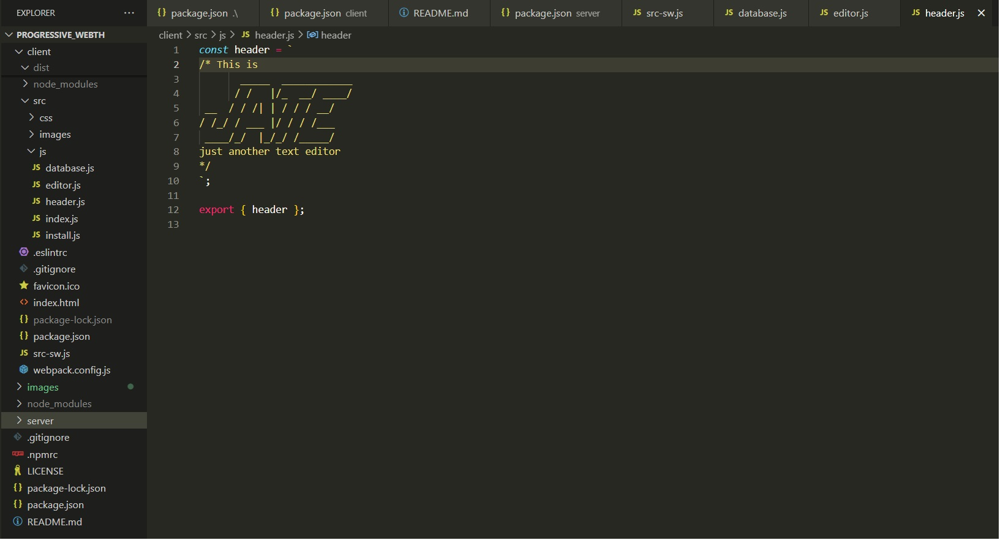

# Progressive Web Application Text Editor

## Description
- This homewrok is about building a web text editor for users to create notes and code snippet both online and offline. The iser can reliably retrieve his data and use afterword. The integrated service workaer and cache API's ensure that the application is fully fuctional.

## Table of Contents
  - [Installation](#installation)
  - [Required Task](#required-task)
  - [User Instruction](#user-instruction)
  - [Command line code](#command-line-code)
  - [Credits](#credits)
  - [License](#license)
  - [Tests](#tests)

## Installation

- Here are the installation process :
  - [1] Here is the repo for this application https://github.com/thalim-glam/progressive_webth
  - [2] The text editor needs a few methods to store and fetch data from IndexedDB.
  - [3] Node.js and various npm pachages were used. All the necessary applications are stored in package.json file.
  - [4] The required modules are bundled in package json which can be istalled using " npm run install ".
  - [5] The npm packages are
    - npm install express [for express.js]
    - npm install --save-dev webpack [for webpack]
    - npm install webpack-dev-server --save-dev [For webpack-dev-server]
    - npm install --save-dev webpack-pwa-manifest
    - npm install babel
    - npm install --save-dev css-loader
    - npm install concurrently --save
    - npm npm install idb [for IndexedDB]
  - [6] Here is the Heroku deployment link: https://pwahomework-7b0871d6f20f.herokuapp.com/

## Required Task 

##### User Story 
```
AS A developer
I WANT to create notes or code snippets with or without an internet connection
SO THAT I can reliably retrieve them for later use
```
##### Acceptance criteria
```
GIVEN a text editor web application
WHEN I open my application in my editor
THEN I should see a client server folder structure
WHEN I run `npm run start` from the root directory
THEN I find that my application should start up the backend and serve the client
WHEN I run the text editor application from my terminal
THEN I find that my JavaScript files have been bundled using webpack
WHEN I run my webpack plugins
THEN I find that I have a generated HTML file, service worker, and a manifest file
WHEN I use next-gen JavaScript in my application
THEN I find that the text editor still functions in the browser without errors
WHEN I open the text editor
THEN I find that IndexedDB has immediately created a database storage
WHEN I enter content and subsequently click off of the DOM window
THEN I find that the content in the text editor has been saved with IndexedDB
WHEN I reopen the text editor after closing it
THEN I find that the content in the text editor has been retrieved from our IndexedDB
WHEN I click on the Install button
THEN I download my web application as an icon on my desktop
WHEN I load my web application
THEN I should have a registered service worker using workbox
WHEN I register a service worker
THEN I should have my static assets pre cached upon loading along with subsequent pages and static assets
WHEN I deploy to Render
THEN I should have proper build scripts for a webpack application

```

## User Instruction

  - Click here for the repository: https://github.com/thalim-glam/progressive_webth 
  - Click here for Readme file: https://github.com/thalim-glam/progressive_webth/blob/main/README.md 
  - Here is a sample screenshots of my application :
    - Screenshot of Just Another Text Editor localhost 
    - Screenshot of Just Another Text Editor client 
    - Screenshot of Just Another Text Editor server 
    - Screenshot of Just Another Text Editor dist 
    - Screenshot of Just Another Text Editor SRC-SW 
    - Screenshot of Just Another Text Editor Heroku 
    
## Command line code

I used the following command lines:
- npm run start [ You may need this to start the server ]
- npm i express [To install modules if you do ot see it ]
- git status
- git add -A
- git commit -m "Comment goes here"
- git branch
- git pull origin main
- git push
- git checkout main
- git checkout -b feature/add-branch

## Credits

Apart from me :D the credit also goes to my Instructor, TAs, Tutor, Classmates, and 
- Google 
- Geeks for Geeks
- Stack Overflow
- MySQL documentatiion
- Class Recordings
- Tutorials Teacher

## License
  

## Tests
The npm packages are
  - npm i
  - npm install express [for express.js]
  - npm install --save-dev webpack [for webpack]
  - npm install webpack-dev-server --save-dev [For webpack-dev-server]
  - npm install --save-dev webpack-pwa-manifest
  - npm install babel
  - npm install --save-dev css-loader
  - npm install concurrently --save
  - npm npm install idb [for IndexedDB]

### Done By: Tasneem Halim 😎

